---
lab:
    title: 'Lab 3.1: Upload assets'
---

# Module 3: Manage customers and assets in Dynamics 365 Customer Insights - Journeys

## Lab 3.1: Upload assets

### Lab Overview

#### Scenario
Contoso Coffee sells industrial-grade and personal coffee marchines to both coffee business owners who use Contoso coffee machines in their individual shops; businesses who have Contoso coffee machines in their corporate offices; and individual customers who use Contoso Coffee machines in their homes. This year, the company is releasing a brand new product called the Airpot XL Smart Coffee Machine. They plan to market this new product to both business and individuals.

The marketing team decides to put together a cross-sell campaign to encourage current customers to consider upgrading to their new intelligent coffee machine. They plan to send a series of emails with a call to action for the customer to click a link that will trigger a phone call from a sales rep. They plan to run this campaign for 2 months.

For this campaign, the Marketing Coordinator will need to:
- Upload marketing assets to use in the email campaigns.
- Build the marketing emails to send to customers.
- Build the journey that will automate the delivery of the campaign content.

To get started, the Marketing Coordinator needs to upload the digital assets that will be used in the campaign. They also need to upload any new sales contacts the company has acquired recently and update details for existing contacts and accounts.

## Lab Overview
This lab is comprised of four tasks:
1. In the first task, you will upload image files to be used in marketing emails. These files will be uploaded to the real-time asset library.
2. In the second task, you will update details for existing contacts within Dynamics 365 Customer Insights - Journeys.
3. In the third task, you will create a task template that will be used in the journey.
4. In the fourth task, you will configure the default brand profile to be used in your marketing assets (like emails).

### What you’ll need:
- A computer or VM with a Dynamics 365 Customer Insights - Journeys environment
- The image files to be used in marketing content. These can be found in your authorized lab host, or in the **MB-280T03-Assets.zip** file in the Instructions/Labs/Media folder in the GitHub repository. Ask your trainer if you have trouble finding them.

### Exercise 1: Prepare marketing assets 
## Task 1: Upload images to the asset library
1. Download the image files from the resource documents. Extract the files to a folder on your desktop.
2. Log into Dynamics 365 Customer Insights - Journeys with your admin credentials.
3. By default, you should be in the Real-time journeys area. Confirm that you are in the Real-time journeys area by opening the area selector in the bottom left of the screen.
4. In the left menu, navigate to the Assets section. Select **Library**. Select the **+ New** button to open the upload files window.
5. Select **+ Add files**, locate the image files on your local computer, and select them.
6. While the upload window is open, add a logo tag to contosologo.png. (Start by typing logo into the text box below the image file name. After typing *logo*, select what you just typed. A tag will be added below the file name.)
7. Select **Upload**. Ensure the image files uploaded - a green checkmark with Done will appear for each file. (It may take a few minutes for the files to upload.) Select **Close.**
8. Using the Filter by keyword search box, enter *con* and press enter. By default, this filter searches by the file name. Verify that contosologo.png appears in the search results.
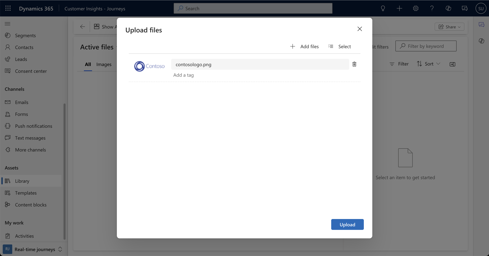

These files will now be available for users to incorporate into their marketing operations.

### Task 2: Update existing contacts
1. Log into Dynamics 365 Customer Insights - Journeys. Ensure that you are in the Real-time journeys area.
2. From the left navigation, select **Contacts** under the Audience group.
3. Open the contact **Alva Tharaldsen.**
   - Under Account Name, select **Bellows College**. You will then navigate to the Bellows College account record.
   - Scroll down to the **Contacts** subgrid. All Contacts associated with Bellows College are listed here. Click on the vertical ellipses at the top of the subgrid, click **Select,** and use the check boxes to select all the contacts in the list at once.
   - At the top of the Contacts subgrid, select the **vertical ellipses.** Then select **Edit.**
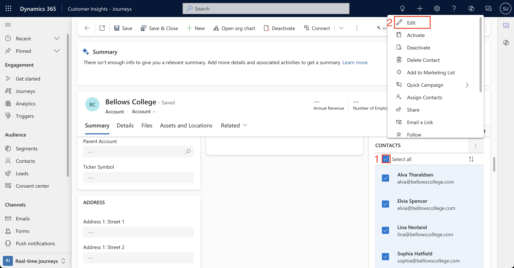
   - On the Details tab, locate the Personal Notes field. Enter "Airpot owner" in the field. Select **Save.**
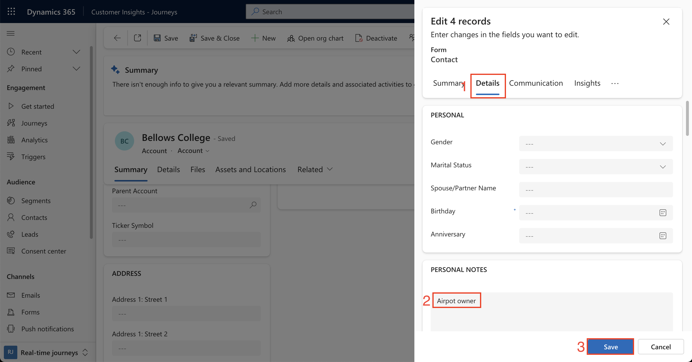
   - Select one of the contacts other than Alva. Navigate to the **Details** tab. Verify “Airpot owner” appears in the Personal Notes field.
4. Navigate back to the **Contacts** entity under the Audience group. 
5. Set a filter on Company Name:
   - Select the **drop-down arrow** next to Company Name. Select **Filter by.** Choose **Equals** then select **Lucerne Publishing, Southridge Video,** and **Wingtip Toys.** (You can select the accounts by either selecting the name directly from the list, or by starting to type the name and selecting the Account name as it pops up.) Select **Apply.**
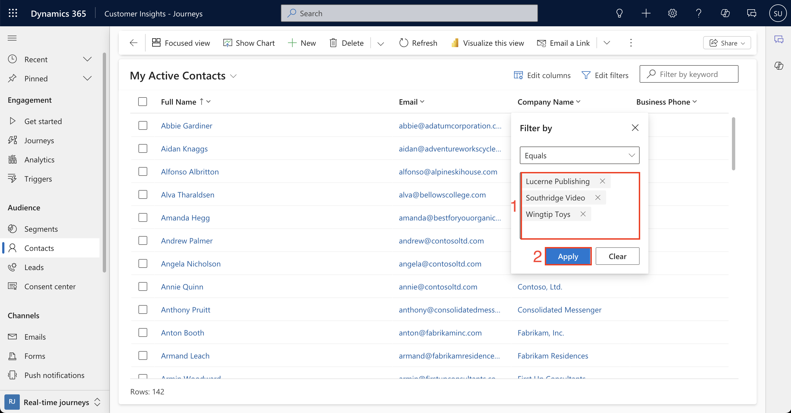
   - Select all contacts for those 3 accounts. (You can select the checkmark next to Full Name in the view header to select all the contacts at once.)
   - Select **Edit** in the command bar. Enter the following:
     - **Address 1: City:** Bellevue
     - **Address 1: State/Province:** Washington
     - **Details > Personal Notes:** Airpot owner
     - Select **Save.**
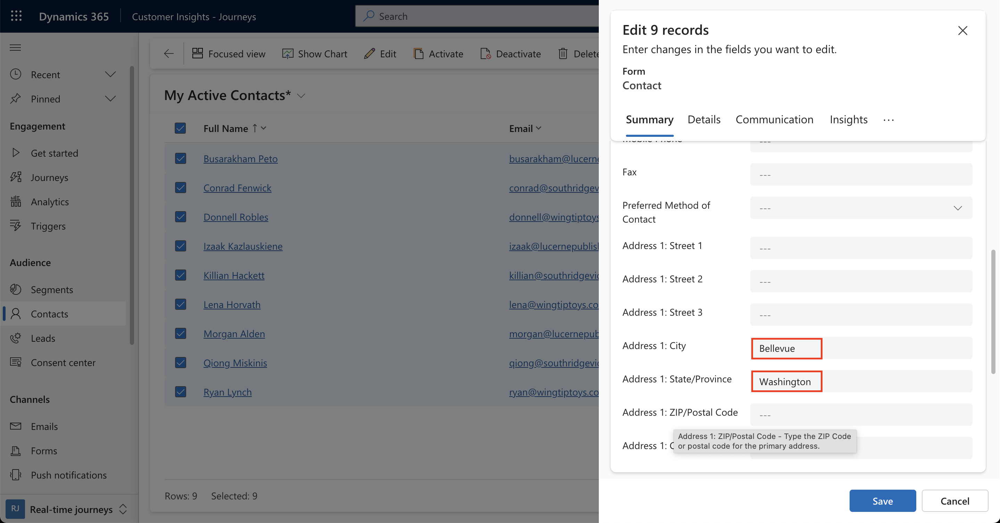
6. Change the filter on Company Name:
   - Select the **drop-down arrow** next to Company Name. Select **Clear filter**.
   - Select the **drop-down arrow** again. Select **Filter by**. Select **Adatum Corporation** and **Northwind Traders**. Select **Apply.**
   - Select all contacts for those 2 accounts.
   - Select **Edit** in the command bar. Enter the following:
     - **Address 1: City:** Redmond
     - **Address 1: State/Province:** Washington
     - **Details > Personal Notes:** Airpot owner
     - Select **Save.**
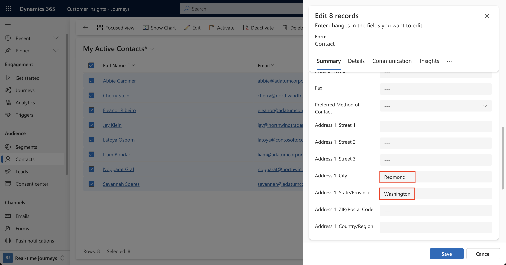
7. Change the filter on Company Name:
   - Select the **drop-down arrow** next to Company Name. Select **Clear filters.**
   - Select the drop-down arrow again and select **Filter by**. Select **Trey Research**, **The Phone Company,** and **Wide World Importers.** Select **Apply.**
   - Select all contacts for those 3 accounts.
   - Select Edit in the command bar. Enter the following:
     - **Address 1: City:** Seattle
     - **Address 1: State/Province:** Washington
     - **Details > Personal Notes:** Airpot owner
     - Select **Save.**
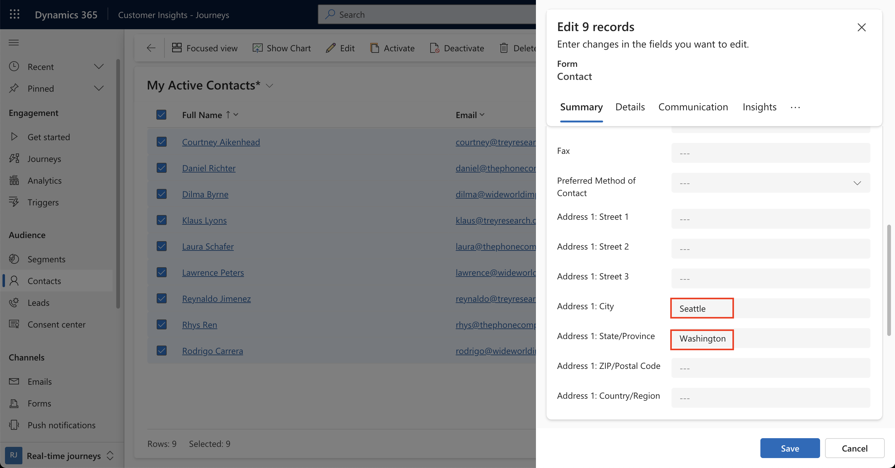

### Task 3: Create a task template
1. Log into Dynamics 365 Customer Insights - Journeys with your admin credentials.
2. Under the **Assets** group, navigate to **Templates**.
3. Select **+New template** then select **Task**.
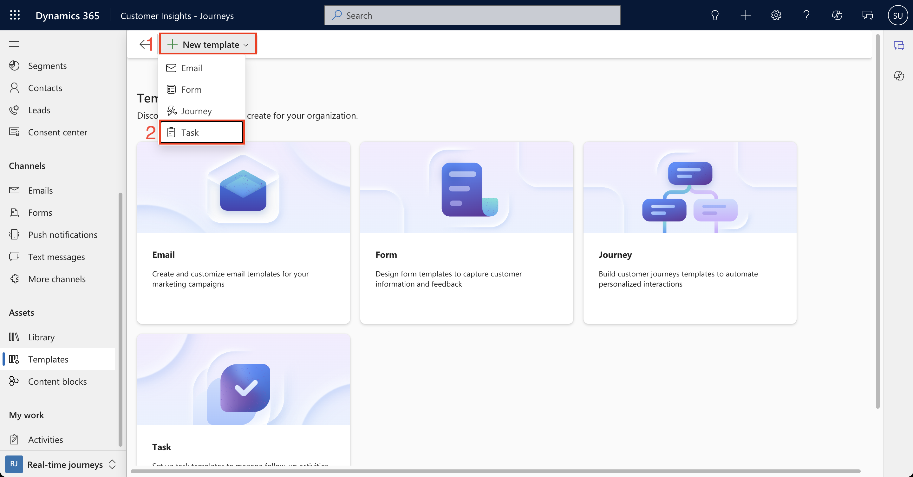
   - Name: Follow up with customer
   - Subject: Upgrade from Airpot to Airpot XL Smart Coffee Machine
   - Schedule type: Delay (in days).
   - Start delay: 0.
4. In the Start time section, select **01** for Hour. Leave Minute blank.
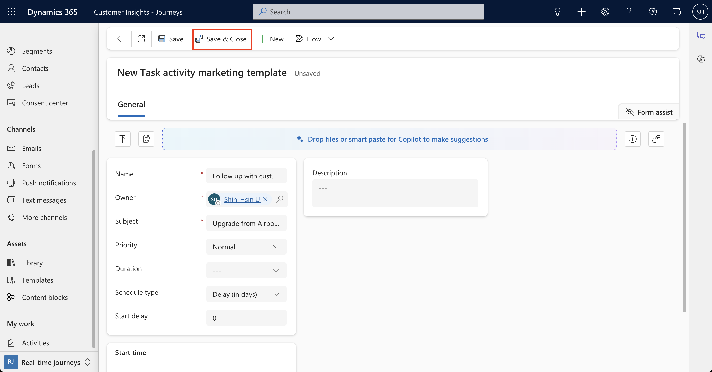
5. Select **Save & Close.**

### Exercise 4: Configure the default brand profile
1. Log into Dynamics 365 Customer Insights - Journeys. Change areas to the **Settings** area.
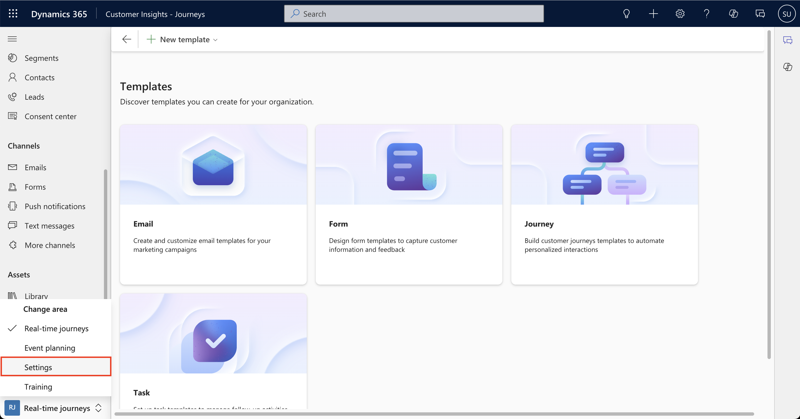
2. In the **Customer engagement** group, navigate to **Brand profiles**.
3. Select the **Default brand profile.**
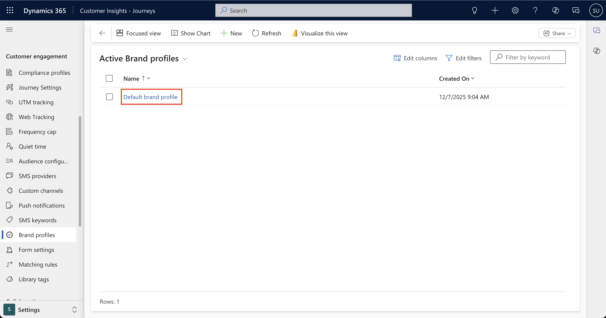
4. Navigate to the **Senders** tab. You should see the Default sender record in the sub-grid. 
5. Select the Social links tab. Fill in the following:
    - LinkedIn URL: https://www.linkedin.com/company/contoso12345/about/
    - Twitter URL: https://twitter.com/ContosoInc
    - Facebook URL: https://www.facebook.com/Contoso-102137176602590/
6. Select **Save & Close.**
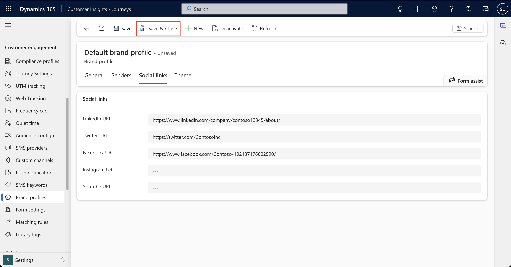

