---
lab:
    title: 'Lab 3.2: Create an email'
---

# Learning Path 3: Manage customers and assets in Dynamics 365 Customer Insights - Journeys

## Practice Lab 3.2: Create an email

### Lab Overview

#### Scenario
For this campaign, the marketing team plans to do a large blitz around its newest smart coffee machine. They plan to send a three-email series. The first email will promote Contoso’s smart coffee machine. The second email is intended to encourage owners of the regular Airpot to upgrade to the new smart machine. The third email is a reminder about the new product launch. 

### Lab Overview
This lab comprises three exercises:
1. In this exercise, you will create an email using an email template.
2. In this exercise, you will create an email by copying another email.
3. In this exercise, you will create an email by copying another email.

### What you’ll need:
- A computer with a Dynamics 365 Customer Insights - Journeys environment

## Exercise 1: Create a marketing email
### Task 1: Create an email from a template
1. Log into Dynamics 365 Customer Insights - Journeys. Ensure you are in the **Real-time journeys area.**
2. Navigate to **Emails** under the Channels group.
3. Click **+New** to create a new email.
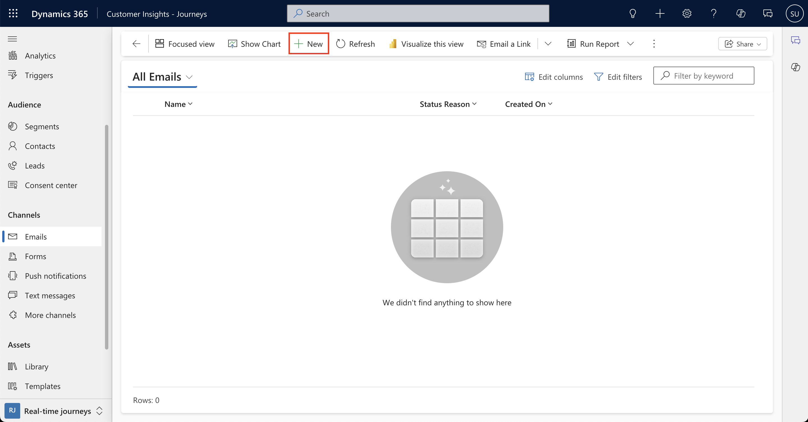
4. From the template gallery, scroll down to the **Layouts** section. sSelect **1-2 column** and **Select.**
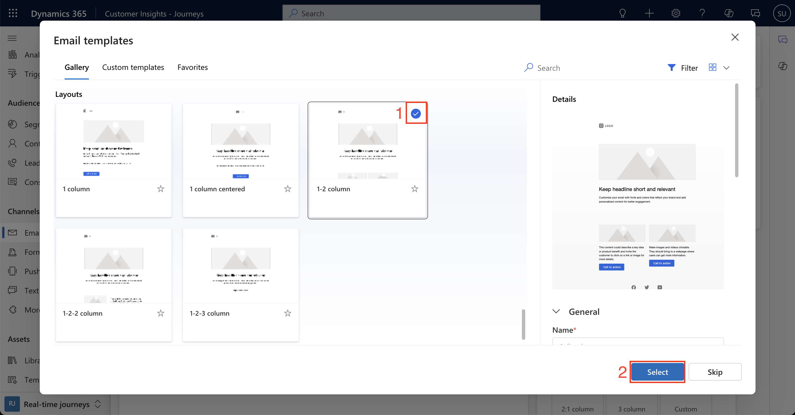
5. In the upper left corner, change the name of the email from *Email 1* to *Smart Machine Campaign Email.* (When you hover over **Email 1** in the upper left corner, you should be able to type into that text box.)
6. Select the **From Name/Subject box** in the designer to display the Email header details.
   - Type the following in the Subject: “Finally, a coffee machine that gets me."
   - Select **Default brand sender** as the sender (if it is not already). The From name and From email should populate and should be read-only.
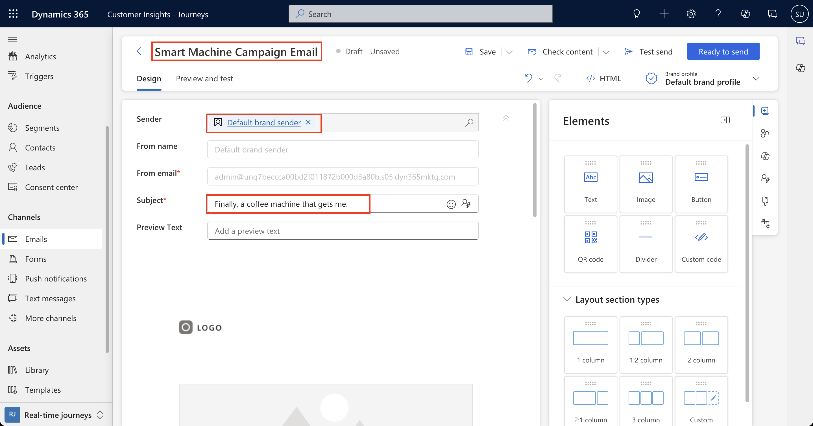
7. Locate the **Toolbox** menu on the far right, which will show up as a series of icons. Hovering over the icons will show you the name of each tab. Select the **Theme** tab, which looks like a paintbrush.
   - **Note:** The details in this section affect the entire email. If you add new text elements to the email, it will default to the font, size, and color listed here. You can then update those elements as needed.
   - Change the **Font family** to: Segoe UI.
   - Change the **body text color** to: #404040.
   - Change the **email background** to: #CCCCCC.
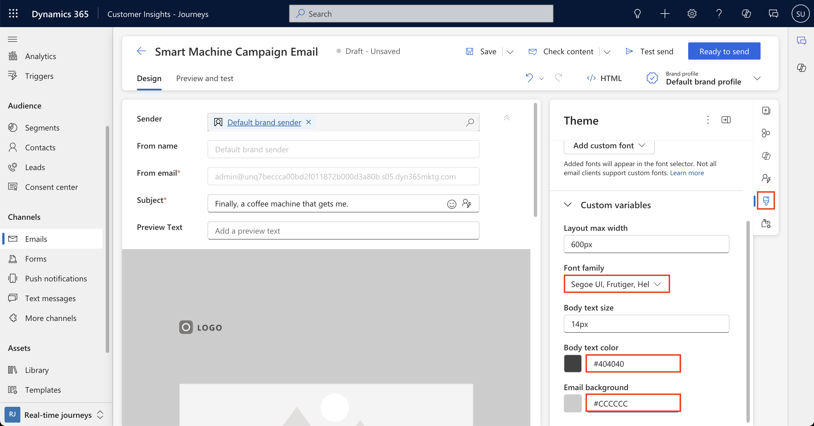
8. In the email itself, find the first section and select it. An Edit layout tab will appear. Change the Section background color to a shade of gray.
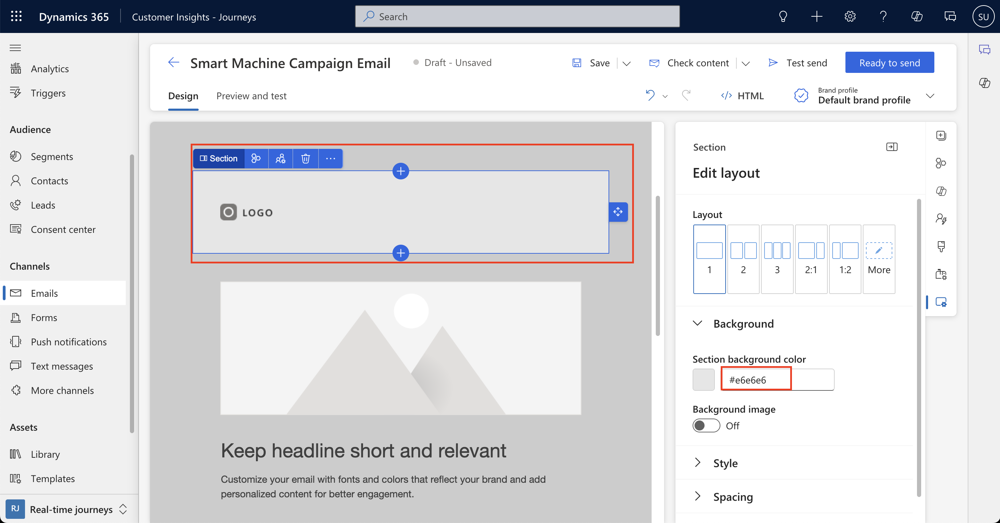

## Task 2: Update images
In this task, we will update the logo.

1. Select the image in the first section on the designer.
2. On the right, click the placeholder image. Select **Replace image** then choose **Browse library.**
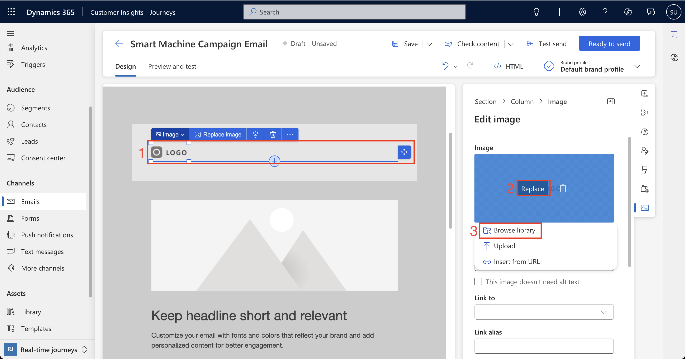
3. Select the **Contoso logo** then click **Select.**
4. Replace the Alt text with *Contoso logo*.
5. Select the **Link to** to drop down, and then select **URL**. Enter *www.contoso.com.*
6. In the Size and alignment section, if Auto width is on, use the toggle to turn it off. Enter *150px* for the width. The other dimension will automatically update.
7. Next, we will update the second image in the email. Select the image in the section below the logo.
8. Select **Replace image** and **Browse library.**
9. Select the **hero-page.jpg** image. Click **Select.**
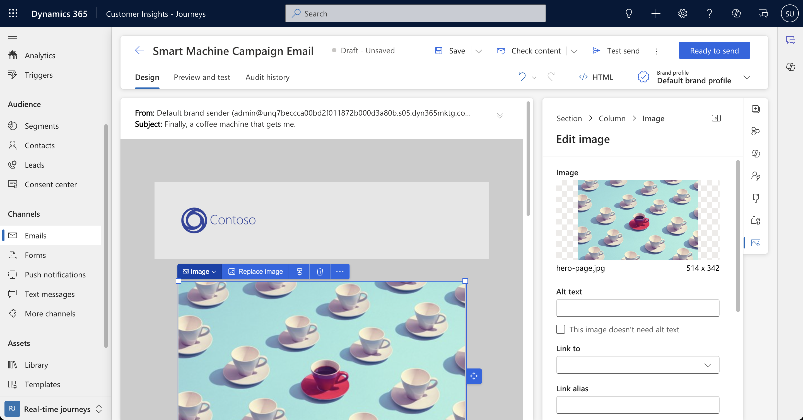

## Task 3: Update a headline using personalization
In this task, we will update a headline to reflect the recipient contact's first name.
1. Navigate to the text section below the logo and select it.
2. Put your cursor at the start of the header text then click **Personalization** in the toolbar at the top of the email. Select **First name** from the dropdown. Ensure **Contact** is selected and select **Choose.**
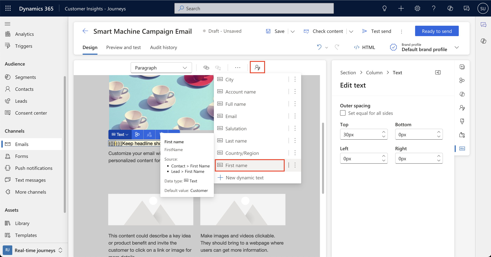
3. Add a comma and a space after {{Firstname}}.
4. Change the placeholder text to: “We’ve got your coffee breaks covered.”
5. Highlight the text, make it bold and change the font size to *26.*
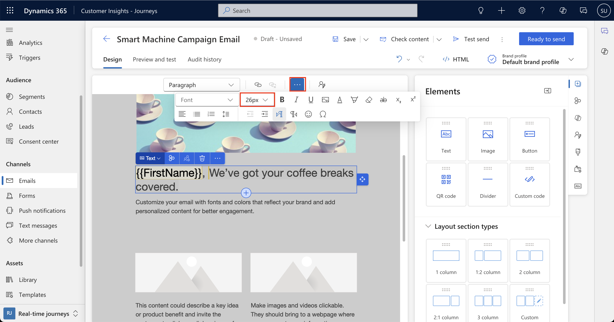
6. Change “Customize your email...” to “The New Airpot XL Intelligent Coffee Machine is like having your own personal barista.”
7. Highlight the text and change the font size to *18.*

## Task 4: Design the rest of the email
1. Select the two-column section below the text. Change the Section background color to a shade of blue.
2. In the left column, select the Image placeholder and click **Replace image.** Select **Browse library** and select **coffee-machine.jpg.** Click **Select**.
3. Replace the Alt text with "Coffee Machine". (If the pane to edit the image doesn't immediately pop up, you can find the image properties as the bottom icon in the **Toolbox** menu.)
4. In **Link to** field, select **URL.** Enter [https://dynamics.microsoft.com/].
5. In the Size and alignment section, toggle Auto width **off.** Change the width to *150px* and let the other dimension set automatically.
6. In the right column under the sub header, select the Image placeholder and click **Replace image.** Select **Browse library** and select **barista.jpg**. Click **Select.**
7. Replace the Alt text with *Barista.*
8. In Link to field, select URL. Enter [https://dynamics.microsoft.com/].
9.  Select the section with the social icons. Change the Section background color to a shade of gray.
10. Select the section with the copyright information. Update the copyright from *2022 Company Inc.* to *2024 Contoso Coffee.*
11. Make any other changes as desired. Feel free to be creative and use any design experience you have. What do you find eye-catching when recieving a marketing email?

## Task 5: Save and test the email
16. On the toolbar, click **Save.**
17. Select **Preview and test.**
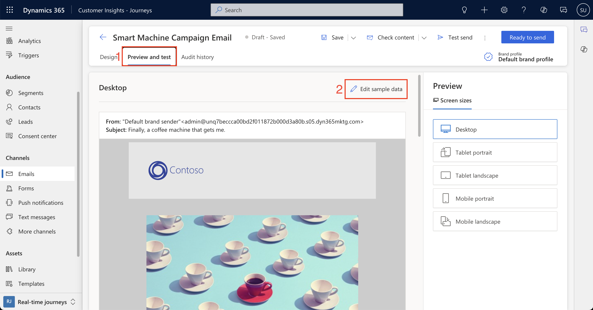
18. Click **Edit sample data**. In the Preview personalization pane, enter the first name of a contact you created. Select the contact to watch the personalization change.
19. Return to the **Preview and test** screen. Preview the email on all screen sizes.
20. Click the **arrow** next to Check content. Run the **Accessibility checker** to see if there are any other issues within the email. Mitigate any other issues as you see fit.
21. On the toolbar, click **Ready to send.**
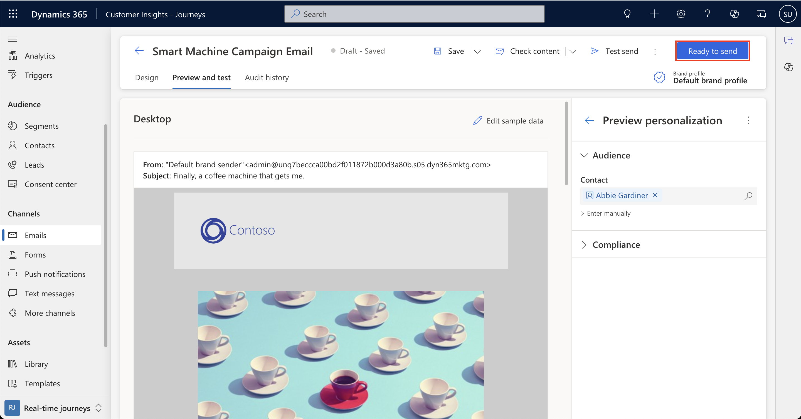

### Exercise 2: Create an email by copying an email

## Task 1: Create an email to existing customers
1. Log into Dynamics 365 Customer Insights - Journeys. Ensure you are in the Real-time marketing area.
2. Navigate to **Emails** under the Channels group.
3. Open the email you created in Task 1.
4. In the command bar, click the **drop-down arrow** next to Save. Choose **Save as.**
5. In the Quick Create menu on the right, name the email *Upgrade Airpot Email.*
6. In the Subject field, enter “Is it time for an upgrade?”
7. Click **Save and Close**. A pop-up will appear that says *Your changes were saved*. Click **View record** to open the new email. (You can also navigate back to **Emails** and open **Upgrade Airpot Email.**)
8. On the designer, change the header text to: “{{Firstname}}, coffee your way, at your fingertips.”
9. Change the copy below the header to: “Your coffee order is as unique as you are. Time to try our new Airpot Smart Coffee Machine.”
10. Select the next two-column section. Change the Layout from 2 to 1:2.
    - In the left column, make the following updates:
      - Remove the text.
      - Remove the button.
    - In the right column, make the following updates:
      - Remove the image.
      - Change the text to: “Half-caf Americano, or double shot latte? However you choose to fuel your day, Contoso Coffee has you covered.” ‎
      - Change the font size to 16 and italicize.
11. Update the button.
    - Select the button.
    - Change Link to to URL.
    - Enter https://dynamics.microsoft.com/.
    - Change the Button text to *EXPLORE THE NEW SMART MACHINE.*
    - Expand **Size and alignment.** Switch Fit to text to **Off.** Change the width to *200px.*
12. On the toolbar, click **Save.**
13. Preview the email.
14. Click **Check content**. Correct any errors if needed.
15. On the toolbar, click **Ready to send.**

### Task 2: Create a follow-up campaign email
1. Log into Dynamics 365 Customer Insights - Journeys. Ensure you are in the Real-time marketing area.
2. Navigate to **Emails** under the Channels group.
3. Open the email you created in Task 2.
4. In the command bar, click the drop-down arrow next to **Save**. Choose **Save as.**
5. In the Quick Create menu on the right, name the email *Smart Machine Campaign Reminder.*
6. In the Subject field, enter “Have you seen the news?”
7. Click **Save and Close.** A pop-up will appear at the upper right that says Your changes were saved. Click **View record** to open the new email. (You can also navigate to the Emails list and open **Smart Machine Campaign Reminder**.)
8. Change the header text to: “The new Airpot Smart Machine: available this fall!”
9. Change the copy below the header to: "Our new Airpot Smart Machine is a new way to make coffee. Learn more about the first-of-its-kind coffee machine today."
10. Remove the two-column section.
11. On the toolbar, click **Save.**
12. Preview the email.
13. Click **Check content**. Correct any errors if needed.
14. On the toolbar, click **Ready to send.**

